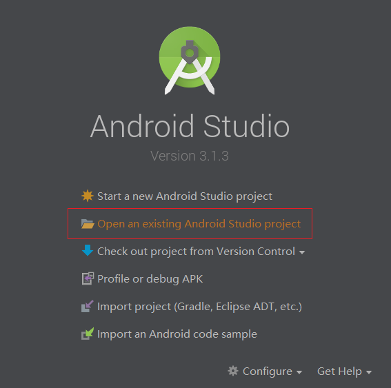
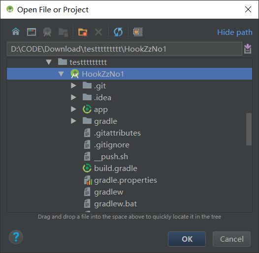
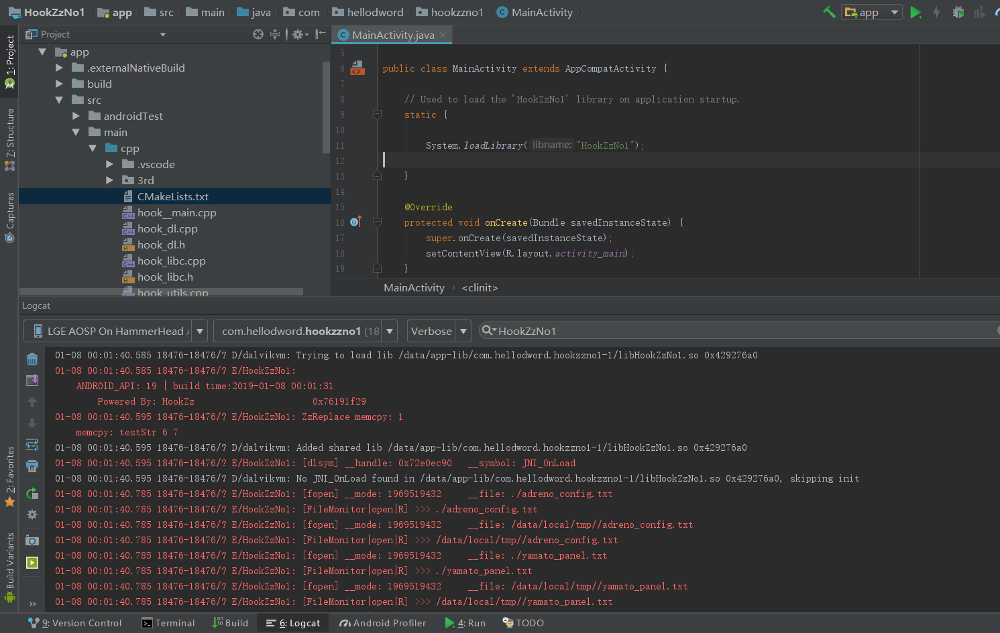

# [**HookZz**](https://github.com/jmpews/HookZz) No.1 

[README 中文版](README.zh-CN.md)


This is a simple Android demo for using [HookZz](https://github.com/jmpews/HookZz). You can build it with Android Studio(3.0+). 


## How to use this demo

```sh
git clone --depth 1 https://github.com/hellodword/HookZzNo1.git 
cd HookZzNo1
rm -r app/src/main/cpp/3rd/HookZz
git clone --depth 1 https://github.com/jmpews/HookZz.git app/src/main/cpp/3rd/HookZz
```







## How to Update HookZz 

```sh
cd app/src/main/cpp/3rd/HookZz/
git fetch origin master
git merge FETCH_HEAD
git log -2
```  