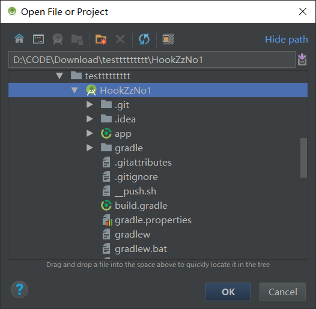

# [**HookZz**](https://github.com/jmpews/HookZz) No.1 

这是一个简单使用 [HookZz](https://github.com/jmpews/HookZz) 的 Android demo, 直接用 Android Studio 3.0 打开即可编译. 

## 怎么使用这个 demo

```sh
git clone --depth 1 https://github.com/hellodword/HookZzNo1.git 
cd HookZzNo1
rm -r app/src/main/cpp/3rd/HookZz
git clone --depth 1 https://github.com/jmpews/HookZz.git app/src/main/cpp/3rd/HookZz
```





## 怎么更新 HookZz 

```sh
cd app/src/main/cpp/3rd/HookZz/
git fetch origin master
git merge FETCH_HEAD
git log -2
```  

